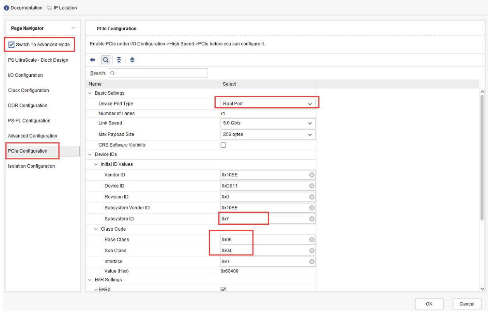
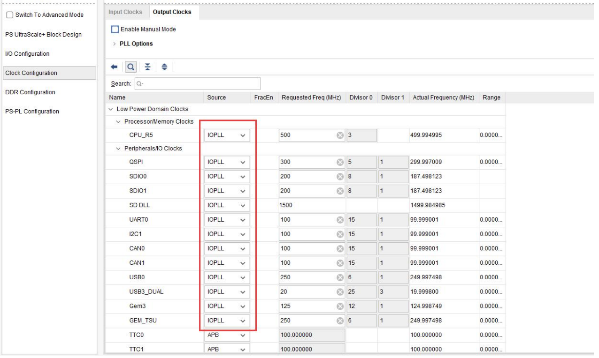
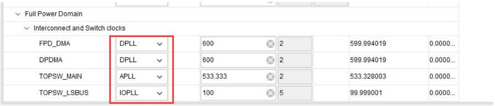
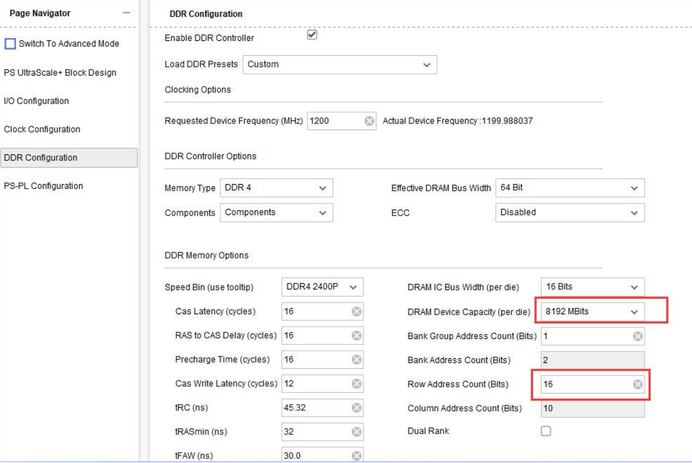

### create project
- create project -> next -> RTL project -> next
- part parameters:
  - family: Zynq UltraScale+ MPSoCs
  - Package: ffvb1156
  - Speed: -2
  - Temperature: I
- 选择 xczu15eg-ffvb1156-2-i

### PS basic block design

#### create block design
  - 添加 Zynq UltraScale+ MPSoC IP 核

#### I/O Configuration

##### low speed
- 配置 BANK0~BANK2 电压为 LVCMOS18，BANK3 电压为 LVCMOS33
- 勾选 QSPI，并设置为”Dual Parallel”模式，Data Mode 为”x4“，勾
选 Feedback Clk，MIO 0..12
- 勾选 SD 0，配置 eMMC。选择 MIO13..22，Slot Type 选择 eMMC，Data Transfer Mode 为 8Bit，勾选 Reset，并选择 MIO23
- 勾选 SD 1，配置 SD 卡。选择 MIO 46..51，Slot Type 选择 SD 2.0，Data Transfer Mode 选择 4Bit，勾选 CD，用于检测 SD 卡插入，选择 MIO45
- 勾选 CAN 0，选择 MIO 38..39，勾选 CAN 1，选择 MIO 40..41
- 勾选 I2C 0，用于 EEPROM 等的 I2C，选择 MIO 34..35
- 勾选串口 UART 0，选择MIO 42..43，勾选GPIO1 MIO
- 勾选 TTC 0 ~ TTC 3

##### high speed
- 勾选 GEM 3，选择 MIO 64..75，勾选 MDIO 3，选择MIO 76..77
- 勾选 USB 0，选择 MIO 52..63，勾选 USB3.0，选择 GT Lane1，USB 复位选择 MIO 32
- 勾选 PCIe，打开 Switch To Advanced Mode，选择 PCIe Configuration，修改以下几个参数，配置为 ROOT 模式
- 回到 I/O Configuration，复位选择 MIO 37；勾选 Display Port，选择 MIO 27..30，Lane Selection，选择 Dual Higher

#### clock Configuration
- 在 Clock Configuration 界面，Input Clocks 窗口配置参考时钟，其中 PSS_REF_CLOCK 为 ARM 的参考时钟默认为 33.333MHz；PCIe 选择 Ref Clk0，100MHz；Display Port 选择 Ref Clk2，27MHz；USB0 选择 Ref Clk1，26MHz
- 在 Output Clocks 窗口，如果不是 IOPLL，改成 IOPLL，保持一致，用同样的 PL
- PL 的时钟保持默认
- Full Power 部分，其他保持默认，将 DP_VIDEO 改为 VPLL，DP_AUDIO 和 DP_STC 改为 RPLL
- 最下面的 Interconnect 修改如下

#### DDR Configuration
- 在 DDR Configuration 窗口中，Load DDR Presets 选择“DDR4_MICRON_MT40A256M16GE_083E”，并修改参数

### 导出硬件，使用 petalinux 定制 linux

#### 导出硬件
- file -> export -> export hardware

#### 使用 petalinux 定制 linux

##### 创建项目
预先准备好 linux-xlinx、uboot-xlinx 这两个仓库
- mkdir -p ~/$PROJ/hardware
- 将导出的硬件复制到 hardware 目录中
- 进入 $PROJ, petalinux-create -t project -n petalinux --template zynqMP 创建 petalinux 项目

##### 配置项目
- 进入创建的 petalinux 项目
- petalinux-config --get-hw-description ../hardware/ 初始化配置，并进入 menuconfig
- 配置本地 linux-xlnx 和 uboot-xlnx，Linux Components Selection -> linux-kernel (linux-xlnx) -> ext-local-src，uboot 同理
- 勾选 fpga manager 驱动
- 修改文件系统类型 Image Packaging Configuration ---> Root filesystem type ---> EXT(SD/eMMC/QSPI/SATA/USB)，设备填写 /dev/mmcblk1p2，保存并退出
- 修改设备树，/petalinux/project-spec/meta-user/recipes-bsp/device-tree/files/system-user.dtsi
  ``` 
  /include/ "system-conf.dtsi"
  / {
  };
  /* SD */
  &sdhci1 {
    disable-wp;
    no-1-8-v;
  };
  /* USB */
    &dwc3_0 {
    status = "okay";
    dr_mode = "host";
  };
  ```
- petalinux-build 编译项目，大致需要 1~2 个小时
- petalinux-package --boot --u-boot --fpga --fsbl --force 生成 BOOT.BIN，在 images/linux 目录下
- 将 BOOT.BIN，boot.scr 以及 image.ub 放到 sd 卡的 FAT32 分区中，并将 images/linux 目录下的 rootfs.tar.gz 解压到 sd 卡的 ext4 分区中，制作根文件系统
- 将启动模式改成从 sd 卡启动，可以成功运行 linux

### linux 基本配置
petalinux 编译时，生成了 PS 侧的所有驱动，并且将基本的工具打包到 rootfs 中。因此，可以直接访问外网（通过网线，PC 与 开发板互 ping，或者网线连接路由器，通过 udhcpc 工具自动获取路由器分配的 ip 地址，从而直接访问外网）

### 动态刷新 PL 以及增加 PS 设备树节点
主要的方式是通过 ssh 将比特流（bin 格式）上传到 PS 侧运行的 linux 中，再通过 fpgautil 工具刷新

#### 操作流程，以 PS 端操作 gpio 控制 PL led 为例
- 使用之前创建的 xpr 项目，在 vivado 中添加 axi_gpio ip 核，将管脚引出，并绑定到 led 上，synth、impl 生成比特流之后，导出硬件 xsa
- 使用 xsct dt_overaly.tcl system_wrapper.xsa psu_cortexa53_0 /opt/device-tree-xlnx/ overlay 生成设备树，包括 pl.dtsi（[dt_overaly.tcl 下载](https://xilinx-wiki.atlassian.net/wiki/download/attachments/18841847/dt_overaly%20.tcl?version=1&modificationDate=1536676250116&cacheVersion=1&api=v2)）
- 使用 dtc -O dtb -o pl.dtbo -b 0 -@ overlay/pl.dtsi 生成 dtbo
- 创建 bitstream.bif 文件，使用 bootgen -image bitstream.bif -arch zynqmp -o ./system_wrapper.bit.bin -w 生成 bin 文件
- 将 bin 与 dtbo 文件上传到 arm linux 里，在 arm 中使用 fpgautil -b system_wrapper.bit.bin -b pl.dtbo 刷新 PL 比特流以及增加 PS 侧设备树
- 在 /sys/class/gpio 中可以看到新增的一个 gpiochip，只有一个管脚，对应着 PL 的 led，之后通过 sysfs 的方式，完成对 PL 端 led 灯的控制

使用这套操作流程可以完全远程访问开发板进行开发，并且修改 xpr 导致的 xsa 文件变动，不需要再使用 petalinux 重新编译，节省了时间。